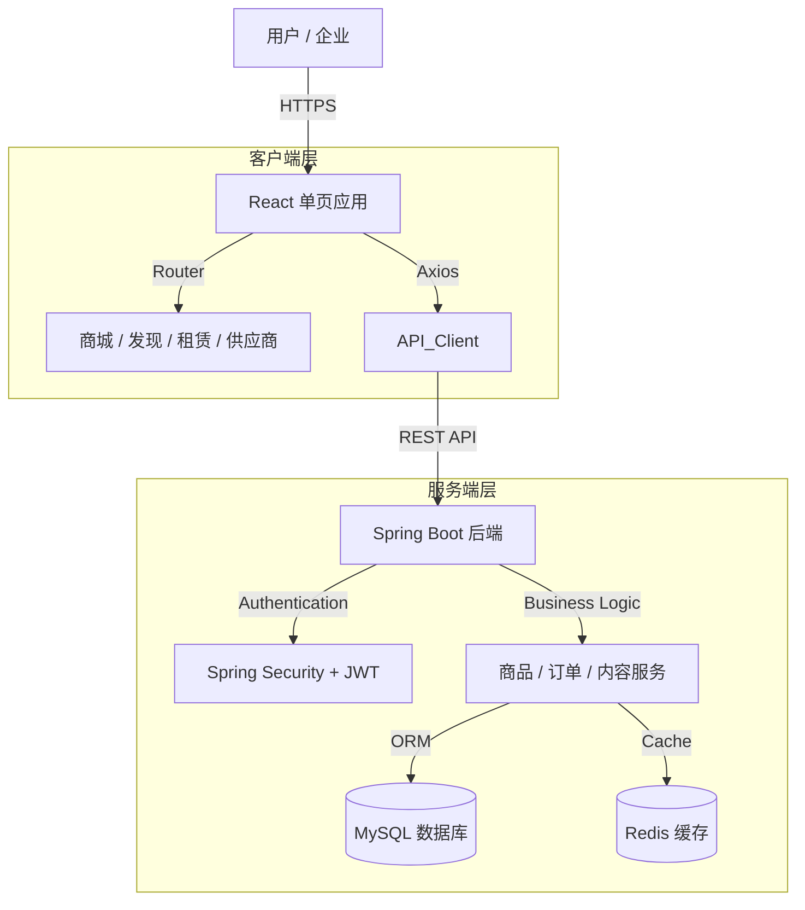

# Refactored README.md

<div align="center">

# MinJue (懂视帝)

### B2B工业设备宣传与电商平台
**[ B2B电商 | 视频内容 | 设备租赁 | 企业服务 ]**

<p>
  
  
  
  
  
</p>

**"[ v1.0 基础服务 ] - [ v2.0 电商交易 ] - [ v3.0 智能服务 ]" 全周期闭环**

[ 商城 ] · [ 发现 ] · [ 租赁 ] · [ 供应商 ]

---
</div>

## 📖 项目介绍 (Project Overview)

**MinJue (懂视帝)** 致力于打造工业设备领域的综合性B2B平台。通过融合电商交易与视频内容发现（类Bilibili模式），解决工业采购中的信息透明度问题。平台支持多种租赁模式（融资租赁/经营租赁），并提供详尽的供应商资质展示，建立商业互信。

## ✨ 核心功能 (Core Features)

| 模块 | 功能 | 说明 |
|------|------|------|
| **商城** | **产品矩阵** | 覆盖12大类工业设备，包括AI视觉检测、工业相机、镜头光源、机器人等。 |
| **商城** | **智能筛选** | 支持多维度筛选、排序及网格/列表视图切换，提升设备查找效率。 |
| **发现** | **视频内容** | 类Bilibili的视频社区，包含设备测评、操作教程和行业洞察。 |
| **租赁** | **双模租赁** | 灵活支持融资租赁（Financial Leasing）和经营租赁（Operating Leasing）。 |
| **供应商** | **企业档案** | 全方位展示企业资质（ISO认证等）、经营数据及完整产品线。 |
| **交互** | **在线咨询** | 支持与供应商进行实时在线沟通。 |
| **AI助手** | **智能选型** | 集成智谱GLM-4-Flash模型，提供7x24小时在线设备选型咨询服务。 |
| **AI助手** | **Markdown渲染** | AI回复支持Markdown格式，包含标题、列表、代码等丰富展示。 |
| **后台** | **供应商审核** | 管理员审核供应商资质（管理后台）。 |
| **后台** | **用户管理** | 用户列表、封禁/解封、角色管理（管理后台）。 |
| **后台** | **数据统计** | 完整的仪表盘数据统计（管理后台）。 |

---

## 🏗️ 技术栈 (Tech Stack)

### 🌐 前端 (Frontend)
- **核心框架**: React 19.2.0
- **构建工具**: Vite 7.2.4
- **样式方案**: Tailwind CSS 4.1.17
- **路由管理**: React Router DOM 7.9.6
- **UI组件库**: Lucide React (图标)
- **状态管理**: Context API / Zustand
- **Markdown渲染**: React-Markdown (AI助手对话)

### 🔧 后端 (Backend)
- **核心框架**: Spring Boot 3.2.2
- **数据库**: MySQL 8.0+
- **ORM框架**: MyBatis Plus 3.5.5
- **缓存中间件**: Redis
- **安全认证**: Spring Security + JWT 0.11.5
- **工具库**: Hutool 5.8.25, Knife4j 4.5.0
- **AI集成**: 智谱GLM-4-Flash (设备选型助手)

---

## 🧭 系统架构 (Architecture)



---

## 📁 目录结构 (Directory Structure)

```
MinJue/
├── backend/                        # Spring Boot 后端工程
│   ├── src/main/java/com/minjue/
│   │   ├── config/                 # 全局配置 (Security, Redis, WebMvc等)
│   │   ├── modules/
│   │   │   ├── admin/              # 管理后台接口模块
│   │   │   ├── content/            # 内容社区模块 (Discovery)
│   │   │   ├── interaction/        # 互动模块 (点赞/收藏/评论)
│   │   │   ├── leasing/            # 租赁业务模块
│   │   │   ├── order/              # 订单交易模块
│   │   │   ├── product/            # 商品管理模块
│   │   │   ├── supplier/           # 供应商黄页模块
│   │   │   └── system/             # 系统基础模块 (User, Auth)
│   │   └── MinJueApplication.java  # 启动类
│   ├── src/main/resources/
│   │   ├── mapper/                 # MyBatis XML Mapper 文件
│   │   ├── application.yml         # 项目主配置文件
│   │   └── init.sql                # 数据库初始化脚本
│   └── pom.xml                     # Maven 依赖配置
│
├── frontend/                       # React 前端工程
│   ├── public/                     # 静态资源 (Logo, Icons)
│   ├── src/
│   │   ├── admin/                  # [v2.1] 管理后台子系统
│   │   │   ├── components/         # 后台专用组件
│   │   │   ├── pages/              # 后台页面 (Dashboard, UserList...)
│   │   │   └── layouts/            # 后台布局
│   │   ├── api/                    # API 接口封装
│   │   ├── assets/                 # 静态图片/样式
│   │   ├── components/             # 公共组件 (Navbar, Footer, Layout...)
│   │   ├── context/                # AuthContext, AdminContext
│   │   ├── pages/                  # 前台页面
│   │   │   ├── auth/               # 登录/注册
│   │   │   ├── home/               # 首页
│   │   │   ├── mall/               # 商城首页
│   │   │   ├── product/            # 商品详情/租赁详情
│   │   │   ├── supplier/           # 供应商主页
│   │   │   ├── user/               # 个人中心/供应中心
│   │   │   ├── content/            # 内容发现页
│   │   │   └── support/            # 帮助中心
│   │   ├── routes/                 # 路由定义
│   │   ├── App.jsx                 # 根组件
│   │   └── main.jsx                # 入口文件
│   ├── package.json                # NPM 依赖
│   ├── tailwind.config.js          # Tailwind 配置
│   └── vite.config.js              # Vite 配置
│
├── documents/                      # 项目文档归档
│   └── resources/                  # 宣传册与演示资源
└── README.md                       # 项目说明文档
```

---

## 🚀 快速开始 (Quick Start)

### 1️⃣ 环境准备 (Prerequisites)
- **JDK**: 17 或更高版本
- **Node.js**: 18.0 或更高版本
- **MySQL**: 8.0+ (需创建数据库 `minjue_db`)
- **Redis**: 6.0+
- **各IDE插件**: 推荐安装 Lombok, Tailwind CSS Intellisense

### 2️⃣ 数据库初始化 (Database Init)
1. 连接 MySQL 数据库，创建 schema：
   ```sql
   CREATE DATABASE minjue_db CHARACTER SET utf8mb4 COLLATE utf8mb4_unicode_ci;
   ```
2. 运行后端脚本 `backend/src/main/resources/init.sql` 初始化表结构和测试数据。

### 3️⃣ 后端启动 (Backend Startup)
使用 IntelliJ IDEA 或命令行启动：
```bash
cd backend
# 1. 编译打包 (可选)
mvn clean install

# 2. 运行
# 注意：请确保 application.yml 中的数据库账号密码配置正确
java -jar target/minjue-backend-0.0.1-SNAPSHOT.jar

# OR 直接通过 Maven 运行
mvn spring-boot:run
```
> 后端服务默认端口: **8080**

### 4️⃣ 前端启动 (Frontend Startup)
```bash
cd frontend
# 1. 安装依赖
npm install

# 2. 启动开发服务器
npm run dev
```
> 前端访问地址: **http://localhost:5173**

---

## 📅 开发路线 (Roadmap)

- [x] **v1.0 基础服务 (2024-01-15)**: 完成产品分类、视频发现、租赁模式及响应式布局。
- [x] **v2.0 电商交易 (2024-01-20)**: 上线完整商城功能、商品详情、供应商主页、购物车及筛选功能。
- [x] **v2.1 管理后台 (2025-01-29)**: 完成管理员认证、供应商审核、用户管理、商品监管等功能。
- [x] **v2.2 分权工作台 (2025-01-29)**: 实现供应商（供应中心）与采购方（个人中心）的差异化工作台与权限隔离。
- [x] **v2.3 功能优化 (2026-02-08)**: 优化联系方式、移除敏感信息、使用Mock数据、改进用户体验。
- [x] **v2.4 AI智能助手 (2026-02-08)**: 集成智谱GLM-4大模型，提供24小时在线设备选型咨询，支持Markdown格式渲染。
- [ ] **v3.0 智能推荐**: 规划AI智能商品推荐、订单预测及移动端App适配。

---

## 📮 联系我们 (Contact Us)

如有任何问题或建议，欢迎通过以下方式联系我们：

| 方式 | 信息 |
|------|------|
| 📧 **客服邮箱** | 2478686497@qq.com |
| 💼 **商务邮箱** | 2696432359@qq.com |
| 🐛 **问题反馈** | [GitHub Issues](https://github.com/varedias/MinJue/issues) |
| ⭐ **项目地址** | [GitHub Repository](https://github.com/varedias/MinJue) |

---

## � 许可证 (License)
MIT License

<div align="center">
<p style="margin: 30px 0 10px;">
    <strong>Development Team</strong>
</p>
<p>
    主开发: <a href="https://github.com/IceYuanyyy" target="_blank" style="font-weight:bold; color: #0969da; text-decoration: none;">IceYuanyyy</a>
    &nbsp;&nbsp;|&nbsp;&nbsp;
    副开发: <a href="https://github.com/varedias" target="_blank" style="font-weight:bold; color: #0969da; text-decoration: none;">varedias</a>
</p>
<p style="color: #666; font-size: 12px;">
    Made with ❤️ by MinJue Team
</p>
</div>
